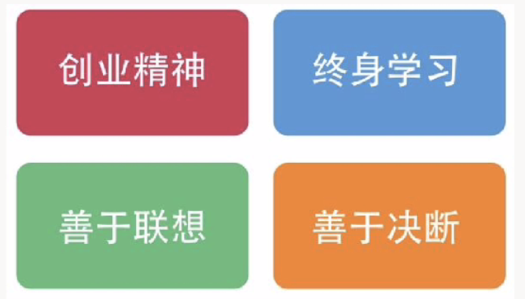

# 产品经理的四个素质

 王诗沐：我在分享网易云音乐产品心得时，经常被提及的问题？

 网易云音乐为什么能火起来？网易云音乐为什么口碑这么好？

 好产品的背后是一流的团队、一流的人才。

> “我过去常常认为一名出色的人才能顶两名平庸的员工，现在我认为能顶50名。我大约花费自己四分之一的时间用于招募人才。“   —乔布斯

 再次强调，洞察和架构时最重要的能力，也是工作中的基础。接下来说说具备什么样素质的人适合做产品经理。

## 创业

 互联网更新非常快，如果没有创业心态很容易掉队，所以第一个素质就是创业心态。要求主动性、责任心、抗压能力都很高，对自己的产品非常热爱并倾注全部心血，凭一己之力影响带动团队达到中心目的。但这样的人很少，因为大部分人都做不到知行合一。

 团队意见不合的时候，没有心态会导致人变成流水线的工具，产品创新失去了意义。但有创业心态时，即便团队、上司意见不合，就会更仔细地思考背后的原因，找出分歧。抉择出最佳方案，并与他人透明、通畅有效的沟通。实在不行则退次位方案，保证产品朝向正确。

 想象总是美好，背后的艰难险阻却未偿体会到，或没有勇气行动。不要光想美好，需面对任何事物背后的勇气。

## 求知

 第二要具备的素质求知，我们需要一直高度的学习心态。身处在这个行业，所有人都会被时间淘汰，多回头看看自己的成长，避免自我感动。

 特别是产品经理，因为学校里，并没有这类相关的课程，因为它实在是太泛，涉猎广。从市场、用户、产品、设计、运营、技术、商业，到心理和美学。其一都可以往很深去研究学习，并有突出几项达到精通。

 作为一名产品，近段时间有什么新发现吗？对环境的考察，对亮处时刻进行关注。

 需求文档该怎么写？用户研究应该怎么做？即是肤浅提问者的表现 。因为绝大部分找到解决办法，并从中获得宝贵教训的经验积累。

 问别人该怎么做之前，问问自己有没有做到知行合一，伸手向别人要结果，这个结果的本质，是否是求知呢？

 这里也不提倡去看一些入门书、大而全的书籍，走马观花，实际动手无从下手（涉及脑科学不同步）；

 推进去看工具类书籍，辅助实践行动捕获真谛。想了解用户需求，即可乘坐地铁去察看用户特征，用什么产品，怎么用。用有效工具进行有效记录。最终积累应用到自己的产品上，实践自己的想法通过验证数据来反馈对错。

## 联想

 网易云音乐播放器界面是一个转动的复古黑胶片，这个设计是怎么来的？

 用户很喜欢这个设计，但它不是凭空创造出来的，也不是靠严密的逻辑推理出来的，它是当我和设计师们看到一张黑胶唱片的照片时联想出来的，这是一个比较简单的联想例子，在黑胶唱片与音乐想传达给用户感受中有相同的感觉，即是高品质、挺有内涵的气质，而用户就喜欢这样的感觉。

  设计师很的联想能力就很强，但联想能力也需要成长，如初级设计师联想到符合审美就东西凑一堆，缺乏框架思维，产出的就是死物。

 要时刻保持客观，站在巨人的肩膀上做更近一步的联想，它并不要求你发明发明某新技术，创造性地设计产品，满足用户需求等……

现在

