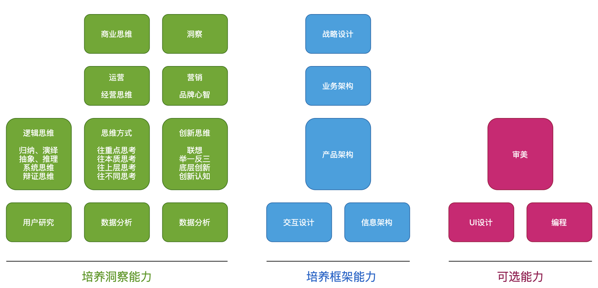

# 前言

作者将互联网产品经理视为存在的事物去深入研究，可理解为一个需要打磨的领域，对作者自身经历优秀的产品观察开始，后总结一些方法论，出得此书帮助大家从事相关工作中获益。

阅读本书，需耐心打磨实践，切勿空谈大道，纸上谈兵。

本书试图贯穿从产品经理新人到负责人的成长，分享，讨论一个想成为优秀的产品经理所需要具备的素质、能力、方法与思维方式。可分为三个时期，同时包含培养洞察能力与架构能力两颗主要的技能树。随着时间积累获得专业知识后，两个能力自然会得到提升，但时间有限，人本各有所长，取长补短即可。

时下流行的“用户增长”“裂变”“注意力经济”等新概念，不要着急万变不离其宗，背后的脉络是可循的，重要的是要练好“基本功”，以及培养我们的思维方式。

